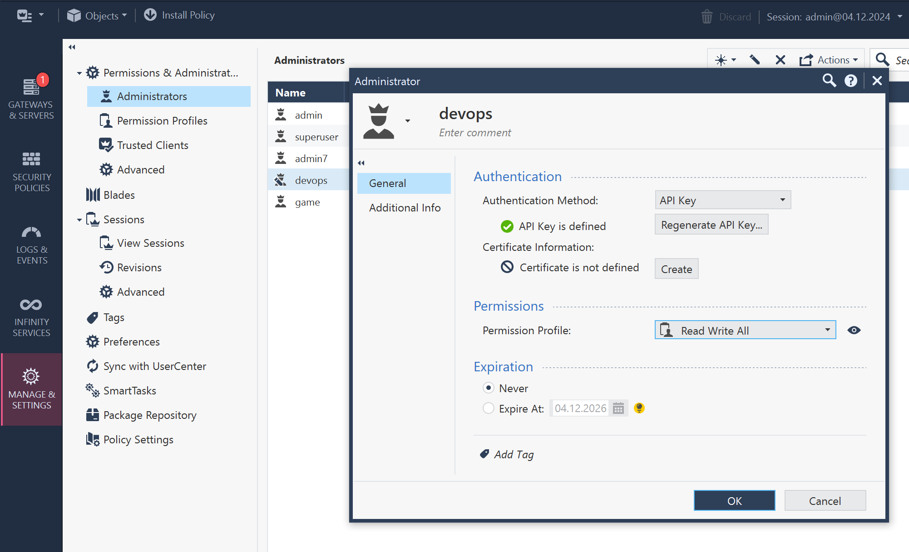

# Check Point policy with Terraform

Resources:
* Check Point Mamagemet API [reference](https://sc1.checkpoint.com/documents/latest/APIs/)
* Check Point Terraform Provider [docs](https://registry.terraform.io/providers/CheckPointSW/checkpoint/latest/docs)
* [SmartTasks](https://sc1.checkpoint.com/documents/R82/WebAdminGuides/EN/CP_R82_SecurityManagement_AdminGuide/Content/Topics-SECMG/SmartTasks.htm) - callbacks from Security Management script / web hook (e.g. implement pre-publish checks per your policy)

## Management API accessibility

Note Management server IP address and review Manage&Settings -> Blades -> Management API settings


## API key (user) for automation

Create a new user `devops` for automation and generate API key. Choose permission profile with required access rights: `Read Write All`.

Note the API key. It serves both as username and password.

Remember to *Install Database* so user is considered when logging-in.



## Summary of inputs

Now we have basic to connect our automation tool to Check Point Management API. Lets store it as environment variables. 

```bash
export CHECKPOINT_SERVER="20.229.217.158"
export CHECKPOINT_API_KEY="use_your_own_key==" # API key for user devops
```

We can even verify [login request](https://sc1.checkpoint.com/documents/latest/APIs/#web/login) with curl:

```bash
curl -k -X POST "https://${CHECKPOINT_SERVER}/web_api/login" -H "Content-Type: application/json" -d "{\"api-key\":\"${CHECKPOINT_API_KEY}\"}"
```

If all works fine, we should get response with `sid` token in JSON response.

## Terraform provider

Same variables can be used in Terraform provider configuration. 
Lets start from [docs](https://registry.terraform.io/providers/CheckPointSW/checkpoint/latest/docs), descrtibing provider configuration on *Use Provider* button:

```hcl
terraform {
  required_providers {
    checkpoint = {
      source = "CheckPointSW/checkpoint"
      version = "2.8.1"
    }
  }
}

provider "checkpoint" {
  # Configuration options
}
```

We create new folder and place `main.tf` file with provider configuration:

```bash
cd $(mktemp -d)

cat <<EOF > main.tf
terraform {
  required_providers {
    checkpoint = {
      source = "CheckPointSW/checkpoint"
      version = "2.8.1"
    }
  }
}
EOF
```

This should be enough to start with Terraform provider. We can now initialize Terraform, so it fetches provider plugin for Check Point Management:

```bash
# Initialize Terraform
terraform init
# see what was added
find .terraform
```

We may study our first resource - [host object](https://registry.terraform.io/providers/CheckPointSW/checkpoint/latest/docs/resources/checkpoint_management_host) - add declare it in terraform. Dedicated file in same folder can be user for this purpose:

```bash
cat <<EOF > hosts.tf
resource "checkpoint_management_host" "example" {
  name = "made_by_terraform"
  ipv4_address = "127.0.0.127"
}
EOF

# see if credentials are set and what would be created
terraform plan

# apply changes
terraform apply
```

If all goes well, we should see new host object to be added to Check Point Management. But the session was not yet published. Find it in GUI and review changes before publishing.

```
Apply complete! Resources: 1 added, 0 changed, 0 destroyed.
```


Here is our new host object:


Consider right click on session and *Publish & Disconnect* it from GUI. This will apply changes to the database and object becomes visible in Smart Console.

## More conntent

* Publish and disconnect session from Terraform
* Import object from Security Management into Terraform
* Bulk operations on objects from CSV/YAML/JSON with Terraform
* [Game](./game/NOTES.md) - who will be first to create host with TF from his machine?
* Session name and description
* Improved publish with easy dependencies (publish made last)
* Protecting *devops* objects with tags and before-publish SmartTask