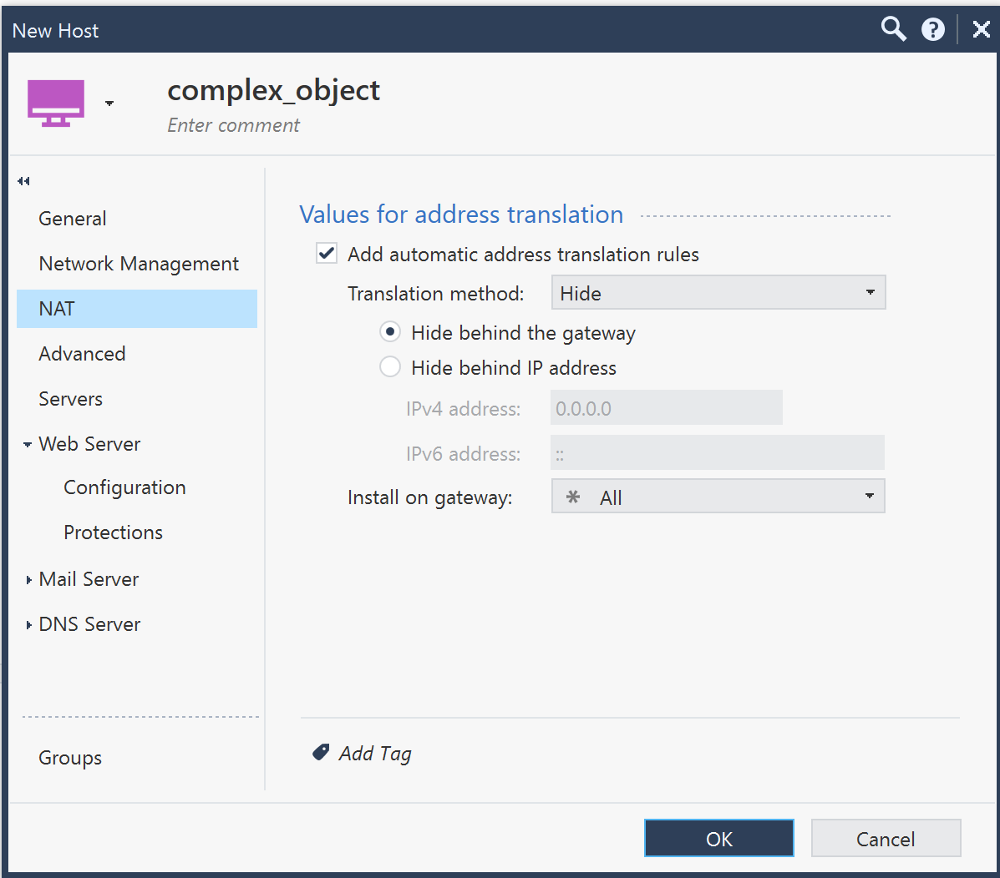

# Import objects from Security Management into Terraform and adopt object code

Lets assume we have existing objects in Check Point Management with complex configiration and we want to manage them with Terraform. We can import them into Terraform state and adopt the code.

Even simple host object can have complex configuration. If you have just created it in your lab, make sure ti publish, so other users including automation tools can see it.



Focus on type and name of the object. We can import it into Terraform state with `terraform import` command. This will create a new resource in Terraform state and we can adopt the code.

But there must be a resource in Terraform code to adopt the object. We can use `checkpoint_management_host` resource for host object. Lets create a new file `imported_hosts.tf` and declare the resource. It can be empty for now.

```bash
# work folder
cd $(mktemp -d)

cat <<EOF > imported_hosts.tf
resource "checkpoint_management_host" "complex" {
}
EOF

cat imported_hosts.tf
```

We still need to tell Terraform how to speak with Check Point Management. We can use `main.tf` file with provider configuration. It can be the same as in previous example.

```bash
cat <<EOF > main.tf
terraform {
  required_providers {
    checkpoint = {
      source = "CheckPointSW/checkpoint"
      version = "2.8.1"
    }
  }
}
EOF

cat main.tf
```

Provider needs to know Check Point Management IP address and API key. We can use environment variables for this purpose. 

```bash
export CHECKPOINT_SERVER="20.229.217.158"
export CHECKPOINT_API_KEY="minFwmFgWYlnvafrdEHrFQ=="
```

Time to initialize Terraform and import the object. We can use `terraform import` command with object type and name. 

Object is of type Host in Check Point Management and its name is `complex_object`. 
Terrform address in `imported_hosts.tf` is `checkpoint_management_host.complex`. This will be target for `terraform import` command.

```bash
terraform init

# import object into Terraform state
terraform import checkpoint_management_host.complex complex_object
```

Time to inspect the object. We can use `terraform show` command to see the object in Terraform state.

```bash
terraform show

# or list all objects
terraform state list

# and show only imported object
terraform state show checkpoint_management_host.complex
```

Notice that Terraform state is now updated with imported object. We can now adopt the code. 
Did you notice that `terraform state show` was already producing HCL code? We can use it to update `imported_hosts.tf` file.

```bash
# only id cannot be defined in Terraform code 
terraform state show checkpoint_management_host.complex | grep -v 'id' > imported_hosts.tf

# review the file
cat imported_hosts.tf
```

We have imported the object into Terraform state and adopted the code. We can now manage the object with Terraform. 

```bash
terraform plan

# lets replace color with blue
grep color imported_hosts.tf

# update the color
# delete line with color inline
sed -i '/color/d' imported_hosts.tf
cat imported_hosts.tf
# add new line with color before the last line
sed -i '$ i color = "blue"' imported_hosts.tf
terraform fmt
cat imported_hosts.tf


# review the changes
code imported_hosts.tf

# apply the changes
terraform apply
```

